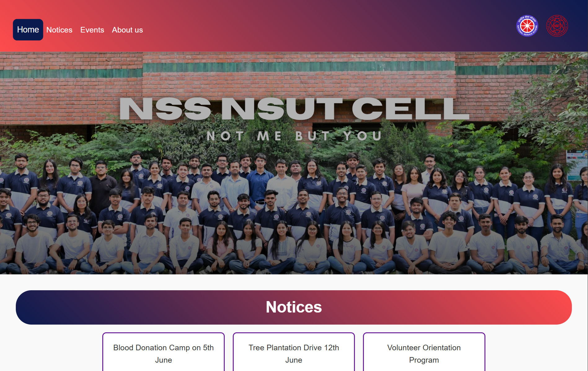
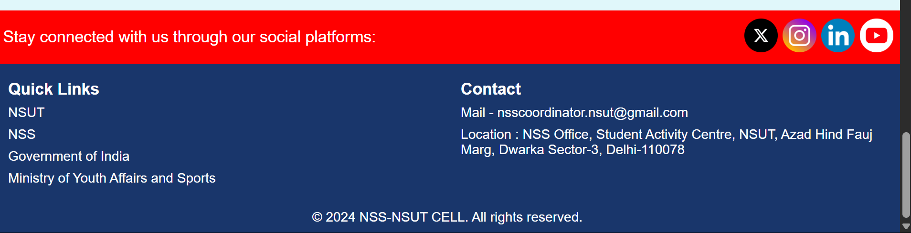
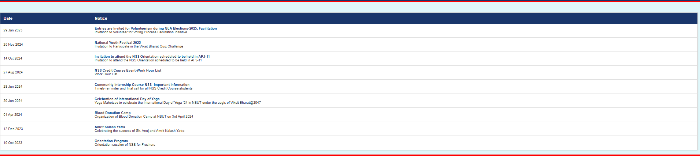
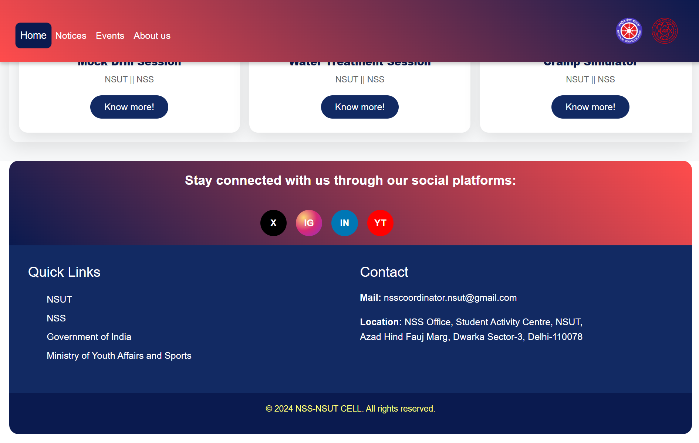
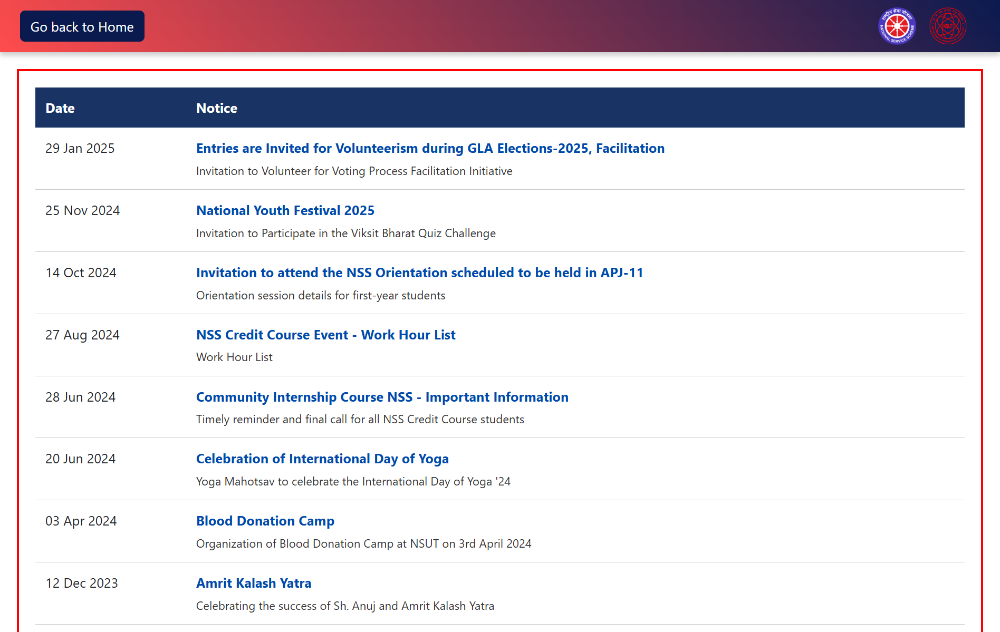
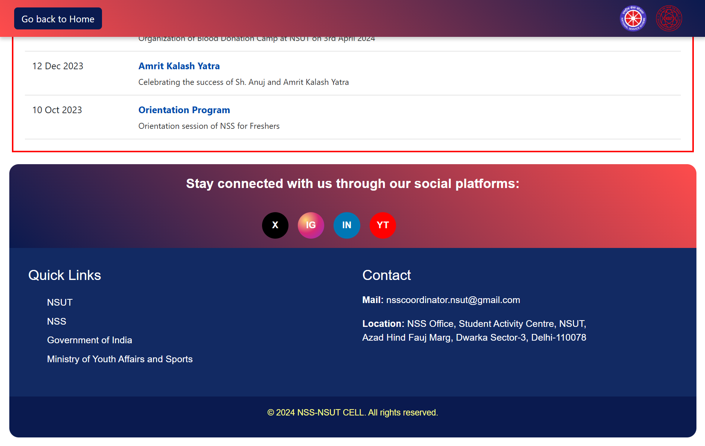

# NSS NSUT Landing Page 🌐

This is a **responsive landing page** created for the **National Service Scheme (NSS), NSUT**, as part of a task given by the NSS society. The page is designed and developed individually by **Ashish**.

## 🚀 Features

- 📱 Mobile-first responsive layout
- 🎨 Modern UI with red and purple tones inspired by the NSS logo
- 🧭 Navigation bar with smooth scroll
- 🎯 Sections: 
  - **Header** (with NSS and NSUT logos, navigation)
  - **Hero Section**
  - **Notices**
  - **Gallery**
  - **Footer**
- 💡 Interactive design with hover effects and media queries

## 📸 Preview

## 🛠️ Technologies Used

- HTML5
- CSS3
- JavaScript (Vanilla)
- Bootstrap 5 (for layout and responsiveness)

## 📂 Project Structure

nss-landing-page/
├── index.html
├── css/
│ └── style.css
├── js/
│ └── script.js
├── images/
│ ├── nss-logo.png
│ ├── nsut-logo.png
│ └── ... (gallery images)
├── README.md

## 🎨 Design Decisions

- Used Bootstrap Grid for layout efficiency.
- Red and Purple hues from NSS branding.
- Focused on clean typography and accessible design.
- Sticky header and responsive navigation.

## 🧑‍💻 Author

**Ashish**  
- [GitHub Profile](https://github.com/ashish-sinsinwal)
- [LinkedIn](https://linkedin.com/in/ashish-sinsinwal-a31b48318)

## 📌 Note

This is **not an official website** for NSS NSUT. It was made individually by Ashish as part of a task given by the NSS society.

---

### 📥 Feel free to fork, clone, or explore the code!

